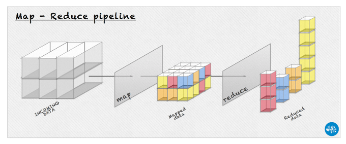

# Mining 911 Emergency calls using Apache Hadoop
- Post files
- Author: luismartingil 
- Website: www.luismartingil.com
- Year: 2013

### Some useful commands
```
# Mount the shared folder in cloudera VM
sudo mount -t vmhgfs .host:/ mnt/

# Make a new folder in the HDFS
hadoop fs -mkdir b2bua/input

# Scp a file into the HDFS
hadoop fs -put ~/_toremove/INb2bua_test.log  b2bua/input/

# Scp from HDFS to local
hadoop fs -copyToLocal /results .

# List files in the HDFS.
hadoop dfs -ls /bigdata13/input

# Cat the given path from the HDFS.
hadoop dfs -cat /bigdata13/output/part-00000
```

### Hadoop diagrams





### Result graphs


